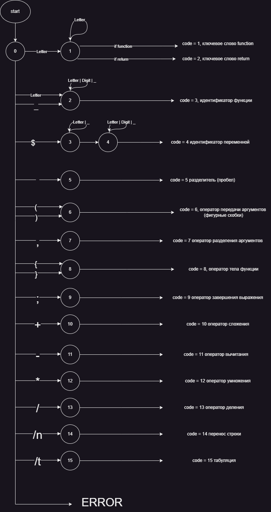
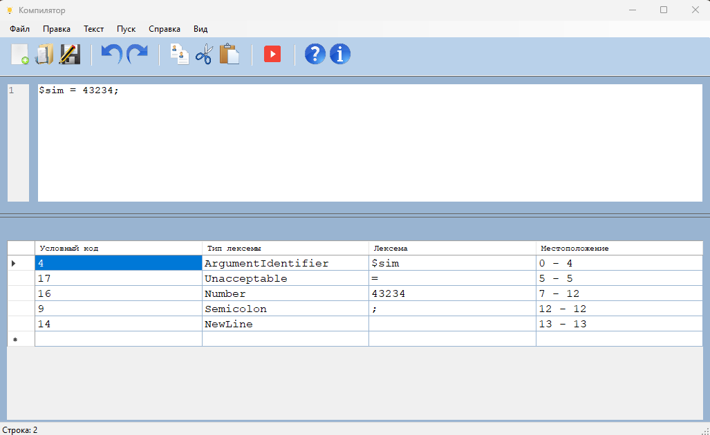
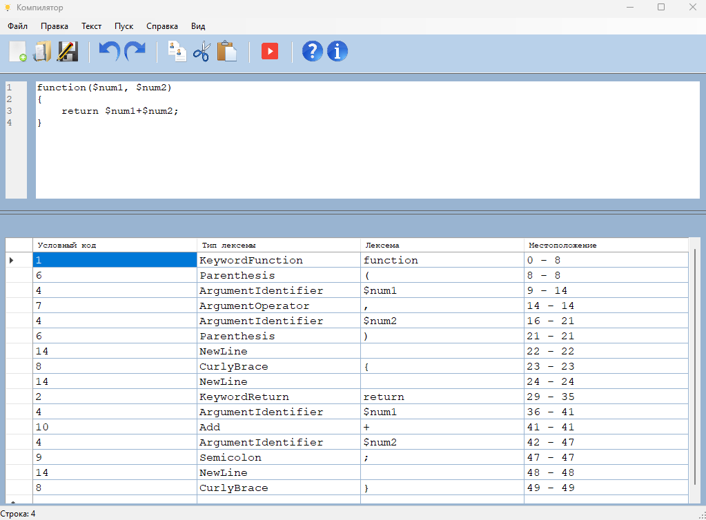
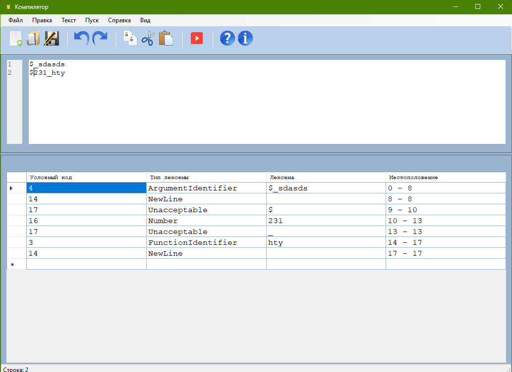

### Компилятор

#### Описание
Компилятор - это приложение для редактирования текстовых файлов с возможностью компиляции и выполнения программ на языке программирования. Приложение разработано как часть курсовой работы по теме "Разработка пользовательского интерфейса (GUI) для языкового процессора" с использованием C# и .NET Framework 4.8.

#### Постановка задачи
Тема: Разработка лексического анализатора (сканера).

Цель работы: Изучить назначение лексического анализатора. Спроектировать алгоритм и выполнить программную реализацию сканера.

В соответствии с вариантом задания необходимо:

1) Спроектировать диаграмму состояний сканера (примеры диаграмм представлены в прикрепленных файлах).
2) Разработать лексический анализатор, позволяющий выделить в тексте лексемы, иные символы считать недопустимыми (выводить ошибку).
3) Встроить сканер в ранее разработанный интерфейс текстового редактора. Учесть, что текст для разбора может состоять из множества строк.

#### Вариант задания на лабораторную работу
45. Создание функции языка PHP

#### Примеры допустимых строк
``` 
function($num1, $num2)
{
    return $num1+$num2;
}

```
#### Диаграмма состояний строк


#### Тестовые примеры

1) Тест первый
   
   
2) Тест второй
   
   
3) Тест третий
   
   
#### Лицензия
Этот проект лицензирован под лицензией MIT.

#### Автор
Каршиганова Азиза - разработка приложения.

#### Обратная связь
Если у вас возникли вопросы или предложения по улучшению приложения, пожалуйста, свяжитесь со мной по адресу: akseleu@yahoo.com.
